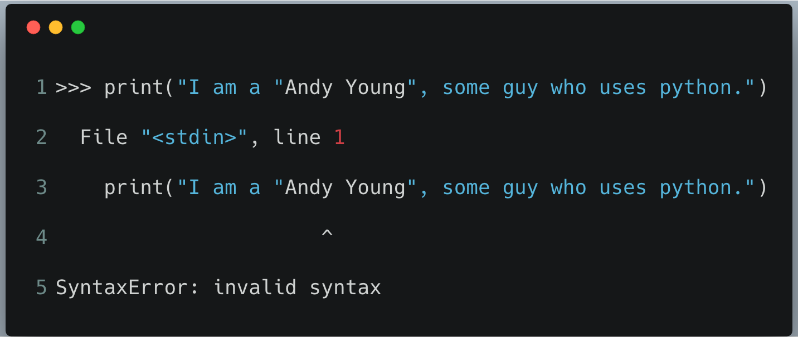
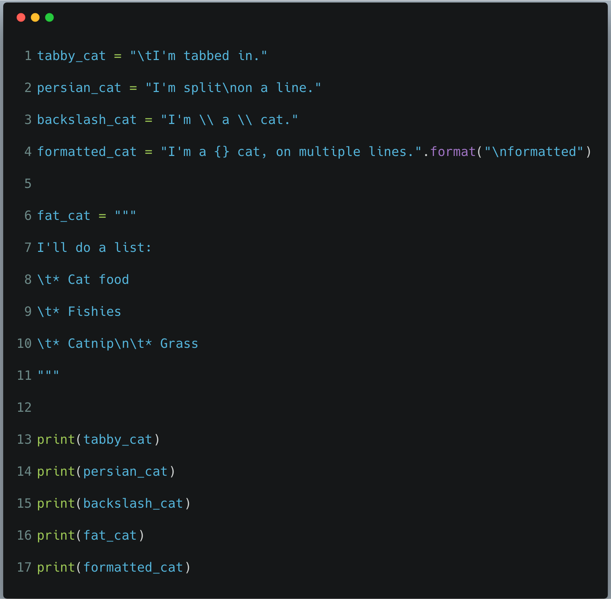
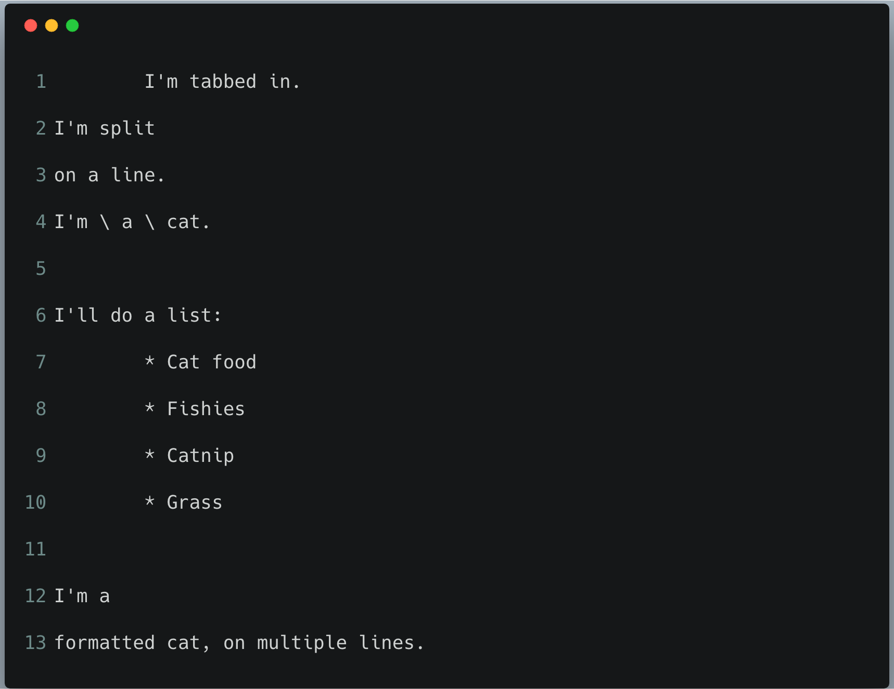

# Exercise 10: What Was That?

So far, we've covered two ways to make a string cross multiple lines. One way is to use `\n`
(backslash n) between the names of the months. These two characters put a _**new line character**_
into the string at that point.

The `\` (backslash) character is called an _**escape sequence**_ and allows operators to only be recognized a character and not a command.

An important escape sequence is a single-quote (**'**) or double-quote (**"**).

For example: If I write, `"I am a "Andy Young", some guy who uses python."`, I will present a problem for the interpreter. Python will be confused as to which set of double-quotes to interpret as a string.

If I run this directly in the python3 shell this is the outcome:



We need a way to tell python that the double-quotes around `"Andy Young"` are to be ignored. To solve this
we will use the _**escape**_ the quotes.

```python
"I am 5'6\" tall." # escape double-quote inside string

'I am 5\'6" tall.' # escape single-quote inside string
```

The other way to make multiple lines is with triple-quotes (**"""**), you can use triple-single-quotes as well (**'''**).
Let's code this out for practice..



## What You Should See

Look for the tab characters that you made. In this exercise the spacing is important to get right.



## Escape Sequences

| Escape | What it does.           |
|--------|-------------------------|
| \\\    | Backslash (\\)          |
| **\\'**    | **Single-quote (')**        |
| \\"    | Double-quote (")        |
| **\\a**    | **ASCII bell (BEL)**        |
| \\b    | ASCII backspace (BS)    |
| **\\f**    | **ASCII formfeed (FF)**     |
| \\n    | ASCII linefeed (LF)     |
| **\\r**    | **Carriage return (CR)**    |
| \\t    | Horizontal tab (TAB)    |
| **\\v**    | **ASCII vertical tab (VT)** |